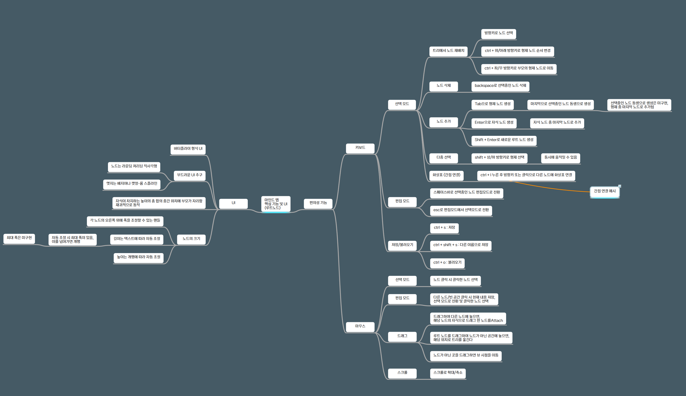

# MindMap

단축키 편의성에 초점을 맞춘 마인드맵 툴
MindNode에서 영감을 많이 받았지만, Windows에서는 이정도 편의성을 갖춘 툴이 없음.

## 단축키

- `Ctrl + S` : Save
- `Ctrl + Shift + S` : Save to
- `Ctrl + O` : Open

## 마인드 맵 편집

1. 노드를 선택 (마우스로 클릭/키보드 방향키)
2. 스페이스 바를 눌러 해당 노드의 내용을 수정.
3. ESC를 눌러 편집을 종료.
(마인드 맵의 노드는 아이디어를 나타내는 정점을 말합니다.)

## 노드 선택/편집 모드

선택 모드 : 노드를 선택할 수 있습니다. 텍스트 편집은 불가능합니다.
편집 모드 : 노드의 텍스트를 편집할 수 있습니다. 다른 노드 선택 시, 즉시 편집 모드가 종료되며 선택 모드로 전환됩니다.

## 노드 추가

선택 모드에서 선택한 노드가 있을 때,
- `Enter` : 자식 노드를 추가
- `Tab` : 형제 노드를 추가 (루트 노드의 경우에는 동작하지 않음)

### 노드 편집

선택 모드일 때,
- `드래그 후 다른 노드에 놓기` : 해당 노드를 다른 노드의 자식 노드로 이동합니다.
- `루트 노드 드래그 후 빈 공간에 놓기` : 해당 트리를 놓은 위치로 이동합니다.
- `Shift + Enter` : 새 루트 노드를 생성합니다.

선택 모드에서 선택한 노드가 있을 때,
- `space` : 편집 모드로 진입합니다. 여러 노드를 선택한 경우, 마지막으로 선택한 노드를 편집합니다
- `방향키` : 방향키에 따라 다른 노드로 선택한 노드를 변경합니다.
- `ctrl + ←/→` : 선택한 노드를 부모/자식 노드로 이동합니다. 루트 노드의 바로 다음 자식인 경우, 방향키에 따라 왼쪽/오른쪽 그룹으로 변경합니다. 루트 노드의 경우, 아무것도 수행하지 않습니다.
- `ctrl + ↑/↓` : 선택한 노드를 위/아래 형제와 순서를 바꿉니다. 방향에 형제가 없는 경우, 아무것도 수행하지 않습니다.
- `ctrl + shift + ↑/↓` : 형제 노드를 동시에 선택합니다. 동시에 선택한 노드는 한번에 이동할 수 있습니다.
- `ctrl + v` : 복사한 이미지를 붙여넣습니다. (텍스트 및 노드는 향후 지원 예정입니다.)
- `ctrl + c` : (복사는 향후 개발 예정입니다.)
- `ctrl + l` : 다른 노드에 연결선을 추가합니다. (추가한 선의 저장/삭제는 아직 지원되지 않습니다.)

편집 모드일 때,
- `Esc` : 편집 모드를 종료합니다. 선택한 노드는 
- `다른 노드 클릭` : 편집 모드를 종료하고 해당 노드를 선택합니다.

## 향후 로드맵

- [x] 간선 + 노드 등 비주얼 업데이트
- [ ] 간접 연결선 저장
- [ ] 간접 연결선 삭제
- [ ] 간접 연결선 추가(`ctrl + l`) 취소
- [ ] 선택한 노드가 형제 노드 중 첫번째 노드거나 마지막 노드일 때 위/아래 방향키로 벗어나는 선택을 하는 경우(a). 또는 자식 노드가 없는 노드 선택 후 방향키로 자식 노드로 이동하려는 경우(b). (a)와 (b)를 수행하려는 경우, *자연스러운 노드 선택*을 한다. *자연스러운 노드 선택*의 기준 : 1) 방향에 따라 (상/하는 x, 좌/우는 y) 좌표가 겹치는 노드 중 가장 가까운 노드. 2) 방향에 따라 가장 가까운 노드
- [ ] `ctrl + v` 텍스트 붙여넣기 기능 추가
- [ ] `ctrl + c` 복사하기 기능 추가 : 텍스트, 이미지, 선택한 노드 포함한 하위 트리 등
- [ ] 테마 색상 조정 기능
- [ ] 연결선 화살표 디자인 변경
- [ ] 연결선 다중 선택
